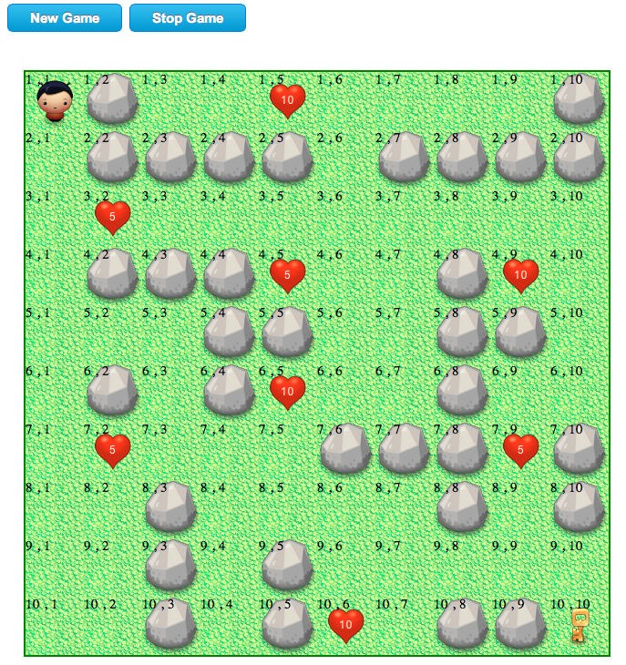

ia-robot
========

Projeto da disciplina de Inteligência Artificial.

O Problema do labirinto
=======================

Considere um labirinto, onde um robô deve caminhar da entrada, até encontrar o ponto de recarga de sua bateria
(Ponto Final). O labirinto é representado como uma matriz de 10x10.

A entrada do labirinto está na posição (1,1) da matriz (Estado Inicial), e o ponto final está em uma posição qualquer 
(aleatória) da matriz. 

Os possíveis movimentos do robô são: 

Estado  | Posição
--------|------
Atual   | x,y 
Cima    | x+1,y
Baixo   | x-1,y
Direita | x,y+1 
Esquerda| x,y-1

O robô somente enxerga a posição imediatamente cima, baixo, direita e esquerda.

Definir uma heurística que faça o robô, caminhar da posição ( 1,1 ) até o ponto final, considerando as seguintes situações.

--
**a. As posições da matriz podem ser divididas em dois tipos:**

- Posições com obstáculos, pelos quais o robô nao poderá passar ( posições escuras ).
 
- Posições sem obstáculos, pelas quais o robô pode caminhar ( posições claras ). 

*Obs.* A posição dos estados inicial e final não podem ser posições escuras.

--
**b. O robô inicia sua caminhada pelo labirinto com 50 "pontos" de energia, e a cada movimento, perde 1 ponto, o jogo pode terminar de duas formas:**

- Quando chega a zero ele "morre" e o jogo termina ( perdeu ).

- Quando chega a posição final do jogo também termina ( ganhou ).

--
**c. Considerar opções que o sistema deverá ter:**

- **Estado Final:** Pode estar na posição (10,10) ou em uma posição aleatória.

- **Posições Escuras:** São aleatórias, e o número delas podem variar de 10 à 30 posições, isto significa que o labirinto é aleatório.

- **Posições Claras:** Podem ser todas são idênticas, ou podem existir posições de recuperação de energia ( 5 posições onde recupera 5 pontos em cada uma e 3 onde recupera 10 pontos, estas posições são aleatórias.

Exemplo de Labirinto:

